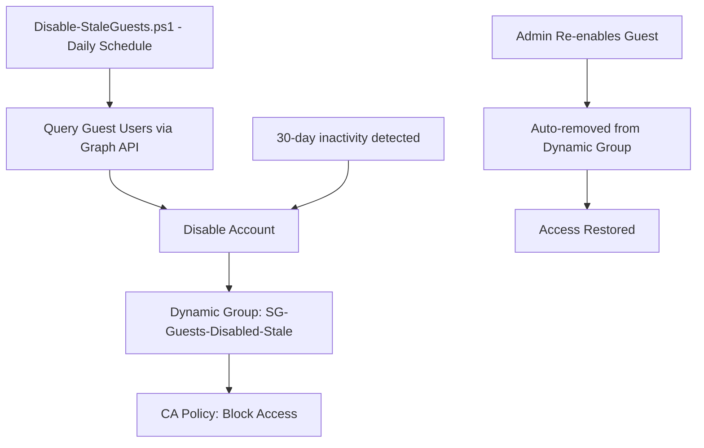

# Entra ID Governance — Stale Guest Lifecycle POC

## Overview

This proof-of-concept automates the lifecycle management of stale guest users (≈50,000) in Microsoft Entra ID without deleting accounts. It uses:

- **Azure Automation** (PowerShell runbooks) for scheduled automation — no Logic Apps
- **Dynamic Security Groups** for self-healing Conditional Access targeting
- **Conditional Access** to block access for disabled guests
- **Microsoft Graph API** for all identity operations

## Architecture



## Prerequisites

| Requirement | Details |
|---|---|
| Entra ID License | P1 or P2 (required for `signInActivity`, dynamic groups, CA) |
| Azure Automation Account | With System-Assigned Managed Identity |
| Graph API Permissions | `User.ReadWrite.All`, `AuditLog.Read.All`, `Group.ReadWrite.All`, `Policy.ReadWrite.ConditionalAccess`, `Application.Read.All` |
| PowerShell Modules | `Microsoft.Graph.Authentication`, `Microsoft.Graph.Users`, `Microsoft.Graph.Groups`, `Microsoft.Graph.Identity.SignIns` |

## Deployment Steps

### 1. Create Azure Automation Account

```powershell
# In Azure Portal or via Az CLI
az automation account create `
    --name "aa-entra-guest-lifecycle" `
    --resource-group "rg-entra-governance" `
    --location "eastus"
```

Enable **System-Assigned Managed Identity** on the Automation Account.

### 2. Grant Graph API Permissions to Managed Identity

Use the `scripts/Grant-AutomationPermissions.ps1` or manually assign:

- `User.ReadWrite.All`
- `AuditLog.Read.All`
- `Group.ReadWrite.All`
- `Policy.ReadWrite.ConditionalAccess`
- `Application.Read.All`

### 3. Import PowerShell Modules in Automation Account

In the Automation Account → Modules → Browse Gallery:
- `Microsoft.Graph.Authentication`
- `Microsoft.Graph.Users`
- `Microsoft.Graph.Groups`
- `Microsoft.Graph.Identity.SignIns`

### 4. Create Dynamic Security Group

Run `scripts/New-DynamicGroup.ps1` or manually create:

- **Name**: `SG-Guests-Disabled-Stale`
- **Type**: Security, Dynamic
- **Rule**: `(user.accountEnabled -eq false) and (user.userType -eq "Guest")`

### 5. Create Conditional Access Policy

Run `scripts/New-ConditionalAccessPolicy.ps1` — deploys in **Report-Only** mode initially.

- **Target**: Members of `SG-Guests-Disabled-Stale`
- **Resources**: All cloud apps
- **Grant**: Block access

### 6. Deploy Automation Runbook

Import `scripts/Disable-StaleGuests.ps1` as a runbook and create a daily schedule.

### 7. Initial Execution (One-Time)

For the first run targeting 365-day stale guests:

```powershell
# Run with -InactivityDays 365 for initial cleanup
.\scripts\Disable-StaleGuests.ps1 -InactivityDays 365 -WhatIf
```

After validating with `-WhatIf`, remove the flag for execution.

### 8. Ongoing Schedule

Set the daily runbook schedule with `-InactivityDays 30` for the ongoing 30-day inactivity threshold.

## Operational Workflow

| Event | Automated Action | Result |
|---|---|---|
| Guest inactive > threshold | Runbook disables account | Added to dynamic group → blocked by CA |
| Admin re-enables guest | Dynamic group auto-removes | CA no longer applies → access restored |
| Re-enabled guest inactive 30 days | Runbook disables again | Re-added to dynamic group → blocked again |

## Cost Estimate

| Component | Monthly Cost |
|---|---|
| Azure Automation (Basic) | Free tier: 500 min/month included |
| Estimated runtime (~50k users) | ~15-20 min/day = ~600 min/month ≈ $0.20 overage |
| Dynamic Group | Included in Entra P1/P2 |
| Conditional Access | Included in Entra P1/P2 |
| **Total additional cost** | **~$0–$1/month** |

## File Structure

```
Entra-GuestLifecycle-POC/
├── README.md                          # This file
├── LICENSE                            # MIT License
├── docs/
│   ├── step-by-step-guide.md         # Full portal walkthrough (10 scenarios)
│   └── testing-checklist.md           # Validation checklist (50 tests)
└── scripts/
    ├── Disable-StaleGuests.ps1        # Main automation runbook
    ├── New-DynamicGroup.ps1           # Creates dynamic security group
    ├── New-ConditionalAccessPolicy.ps1 # Creates CA block policy
    └── Test-GuestLifecycle.ps1        # End-to-end validation script
```

## Important Notes

- **Do NOT delete guest accounts** — disabling preserves the guest object for re-enablement
- Dynamic group membership updates may take 5–30 minutes after `accountEnabled` changes
- The runbook uses batch processing with throttle handling for 50k+ users
- Always test with `-WhatIf` before production execution
- CA policy deploys in Report-Only mode — switch to Enabled after validation

## How Azure Automation Runbooks Work

Azure Automation executes your PowerShell script (`Disable-StaleGuests.ps1`) on a schedule in Azure's serverless infrastructure — no VM, no Logic App, no local machine required.

### Execution Flow

1. **Schedule triggers** the runbook daily (e.g., 02:00 AM)
2. **Managed Identity authenticates** to Microsoft Graph (no stored credentials)
3. **Script queries** guest users with stale `signInActivity`
4. **Script disables** inactive accounts (`accountEnabled = false`)
5. **Dynamic group auto-updates** → CA policy blocks access

### Key Benefits Over Alternatives

| Traditional Approach | Azure Automation |
|---|---|
| Logic App ($$$ per action) | Free tier: 500 min/month included |
| Stored credentials/secrets | Managed Identity (auto-rotated, no secrets) |
| Always-on VM + Task Scheduler | Serverless — runs only when triggered |
| Manual intervention | Fully automated with audit trail |

### Authentication Difference

```powershell
# Azure Automation (Managed Identity — no credentials needed):
Connect-MgGraph -Identity -NoWelcome

# Interactive/local testing (prompts for login):
Connect-MgGraph -Scopes "User.ReadWrite.All" -NoWelcome
```

### Cost

| Component | Monthly Cost |
|---|---|
| Free tier | 500 min/month included |
| This POC (~15-20 min/day) | ~$0–$0.20 overage |
| Managed Identity | Free |
| **Total** | **~$0–$1/month** |
