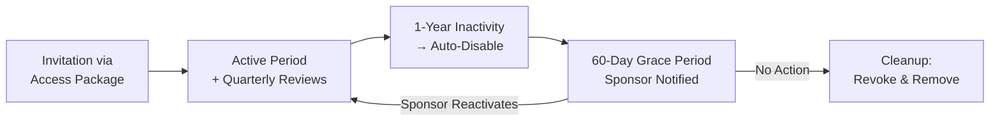
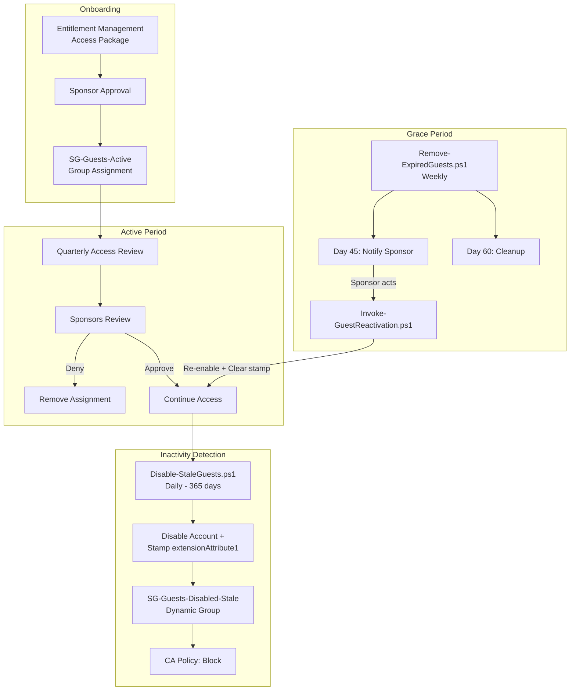

# Guest Lifecycle with Entitlement Management

## Overview

This extension adds **Entra ID Governance** capabilities to the existing stale-guest automation, implementing a complete lifecycle:



## Requirements Mapping

| # | Requirement | Implementation |
|---|---|---|
| 1 | Initial invitation through Entitlement Management | `New-GuestAccessPackage.ps1` — Access Package with Connected Org sponsor approval |
| 2 | Regular access reviews | `New-AccessReview.ps1` — Quarterly reviews; sponsors as reviewers |
| 3 | Auto-disable after 1 year inactivity | `Disable-StaleGuests.ps1` — Updated to 365-day default + disable-date stamp |
| 4 | 60-day grace period before cleanup | `Remove-ExpiredGuests.ps1` — Notifies at day 45, cleans up at day 60 |

## Architecture



## New Scripts

### `scripts/entitlement-management/New-GuestAccessPackage.ps1`

Creates the full Entitlement Management infrastructure:
- **Catalog**: "External Collaboration" — groups access packages for external users
- **Resource Group**: `SG-Guests-Active` — assigned when access is granted
- **Access Package**: "Guest Access - Standard" — requestable by external users
- **Assignment Policy**: Requires Connected Organization internal sponsor approval; includes quarterly access reviews

```powershell
# Dry run
.\scripts\entitlement-management\New-GuestAccessPackage.ps1 -WhatIf

# Execute
.\scripts\entitlement-management\New-GuestAccessPackage.ps1
```

### `scripts/entitlement-management/New-AccessReview.ps1`

Creates a standalone quarterly access review (complements the policy-embedded review):
- Targets guest members of `SG-Guests-Active`
- Sponsors review their guests; group owners as fallback
- Auto-deny if no response (conservative default)
- Uses sign-in activity recommendations

```powershell
.\scripts\entitlement-management\New-AccessReview.ps1 -WhatIf
.\scripts\entitlement-management\New-AccessReview.ps1 -RecurrenceMonths 6  # Semi-annual
```

### `scripts/Remove-ExpiredGuests.ps1`

Weekly runbook for grace period management:
- Identifies disabled guests via `extensionAttribute1` timestamp
- Day 45: Emails sponsor with reactivation warning
- Day 60+: Revokes access packages, removes group memberships
- Optional: Deletes guest account (`-DeleteAccount` flag)

```powershell
# Dry run
.\scripts\Remove-ExpiredGuests.ps1 -SenderUserId "shared-mailbox@contoso.com" -WhatIf

# Production (preserve accounts)
.\scripts\Remove-ExpiredGuests.ps1 -SenderUserId "shared-mailbox@contoso.com"

# Production (delete accounts after cleanup)
.\scripts\Remove-ExpiredGuests.ps1 -SenderUserId "shared-mailbox@contoso.com" -DeleteAccount
```

### `scripts/Invoke-GuestReactivation.ps1`

Sponsor-initiated reactivation during the grace period:
- Re-enables the guest account
- Clears the disable-date stamp
- Optionally restores access package assignment
- Logs the action for audit

```powershell
.\scripts\Invoke-GuestReactivation.ps1 `
    -GuestUserId "xxxxxxxx-xxxx-xxxx-xxxx-xxxxxxxxxxxx" `
    -SponsorId "yyyyyyyy-yyyy-yyyy-yyyy-yyyyyyyyyyyy" `
    -Justification "Ongoing project collaboration through Q3" `
    -RestoreAccessPackage `
    -AccessPackageId "zzzzzzzz-zzzz-zzzz-zzzz-zzzzzzzzzzzz"
```

## Updated Scripts

### `scripts/Disable-StaleGuests.ps1` (Modified)

Changes:
- Default `InactivityDays` changed from 30 → **365** (1 year)
- Now stamps `extensionAttribute1` with ISO 8601 disable date when disabling
- This enables the grace period tracking in `Remove-ExpiredGuests.ps1`

## Prerequisites

| Requirement | Details |
|---|---|
| **License** | Entra ID P2 / Entra ID Governance |
| **Graph Permissions** | Existing + `EntitlementManagement.ReadWrite.All`, `AccessReview.ReadWrite.All`, `Mail.Send` |
| **Connected Organizations** | Must be configured for external partner domains |
| **Sponsor Assignment** | Guests need `sponsors` relationship set (user-level) |
| **Shared Mailbox** | For notification emails from `Remove-ExpiredGuests.ps1` |

## Deployment Order

1. **Configure Connected Organizations** in Entra admin center
2. **Run `New-GuestAccessPackage.ps1`** — creates catalog, package, policy
3. **Run `New-AccessReview.ps1`** — creates quarterly review schedule
4. **Update Automation Account** — add new Graph permissions (`EntitlementManagement.ReadWrite.All`, `Mail.Send`)
5. **Import `Remove-ExpiredGuests.ps1`** as a new runbook with weekly schedule
6. **Import `Invoke-GuestReactivation.ps1`** as an on-demand runbook
7. **Update existing schedule** for `Disable-StaleGuests.ps1` (now defaults to 365 days)
8. **Set sponsors** on existing guest accounts via Graph API or admin center

## Key Design Decisions

| Decision | Rationale |
|---|---|
| No time-based access package expiration | Avoids removing active users; inactivity is the true signal |
| `extensionAttribute1` for disable date | Cloud-only guests always support this; plain ISO 8601 for easy parsing |
| Connected Org sponsors for initial approval | User-level sponsors don't exist pre-onboarding |
| Weekly cleanup schedule | 60-day grace is long enough; daily would be wasteful |
| Separate standalone access review | Catches guests onboarded outside Entitlement Management |
| Cleanup limited to access package scope | Avoids removing legitimate access from other systems |
| Account deletion is opt-in | Conservative default; soft-delete allows 30-day recovery |

## Interaction Between Components

```
┌────────────────────────────────────────────────────────────┐
│ Entitlement Management (Onboarding + Reviews)              │
│  • Controls WHO gets access and HOW                        │
│  • Quarterly reviews validate continued need               │
│  • Denied users lose access package → removed from group   │
├────────────────────────────────────────────────────────────┤
│ Disable-StaleGuests.ps1 (Inactivity Enforcement)           │
│  • Controls WHEN inactive accounts are blocked             │
│  • 365-day inactivity → disable + stamp date               │
│  • Dynamic group + CA → immediate access block             │
├────────────────────────────────────────────────────────────┤
│ Remove-ExpiredGuests.ps1 (Grace Period + Cleanup)           │
│  • Controls WHAT happens after disable                     │
│  • Day 45: sponsor notification                            │
│  • Day 60: revoke assignments, remove memberships          │
├────────────────────────────────────────────────────────────┤
│ Invoke-GuestReactivation.ps1 (Recovery)                    │
│  • Sponsor-driven re-enablement                            │
│  • Clears disable stamp, restores access                   │
└────────────────────────────────────────────────────────────┘
```

## File Structure (Updated)

```
entra-guest-lifecycle-poc/
├── README.md
├── LICENSE
├── docs/
│   ├── entitlement-management-guide.md    ← This file
│   ├── step-by-step-guide.md
│   └── testing-checklist.md
└── scripts/
    ├── Disable-StaleGuests.ps1            ← Updated (365-day default + date stamp)
    ├── Remove-ExpiredGuests.ps1           ← NEW (grace period cleanup)
    ├── Invoke-GuestReactivation.ps1       ← NEW (sponsor reactivation)
    ├── New-DynamicGroup.ps1
    ├── New-ConditionalAccessPolicy.ps1
    ├── Test-GuestLifecycle.ps1
    └── entitlement-management/
        ├── New-GuestAccessPackage.ps1     ← NEW (access package setup)
        └── New-AccessReview.ps1           ← NEW (quarterly reviews)
```
